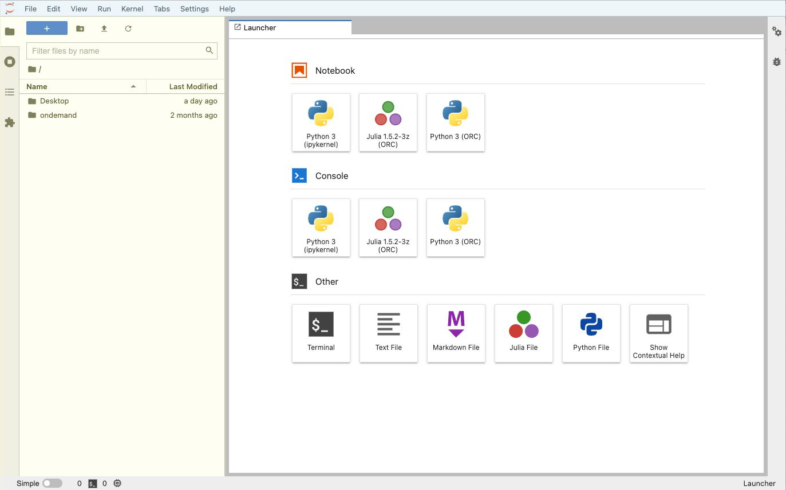

## Why do we want to use JupyterLab? 

We have been using the command line in a terminal window to type and execute our Python commands. 
While it can be very handy to run either simple commands or (as we will see) big programs this way, 
it is not a nice interface for anything in between, including when we write and debug our Python code.

We will use a browser-based interface called `JupyterLab`
which lets us create **notebooks** with **cells** containing our Python code
as well as notes and annotations that use a simple formatting paradigm called **markdown**. 
Jupyter notebooks are also ideal for scientific research because they make it easy to document our work, 
include equations in our documentation, show our analysis results, 
and link to other resources like journal articles. 

Let's set it up and see what it can do!

## Launch JupyterLab

#### 1. Login to the ORC Dashboard

From your browser, go to the [ORC dashboard](https://ondemand.orc.gmu.edu/){:target="_blank" rel="noopener"}
and log in.

#### 2. Launch JupyterLab

Click on the **JupyterLab** app. It will launch a process that will run your instance of JupyterLab on Hopper.

#### 3. Choose your parameters.

Do not add any extra arguments, and let your partition be "interactive".

Select the number of hours for your session (for in-class use, 2 hours is a good choice).

By default for the instance size, you will get a "small" session (2 nodes, abut 4GB). 
This should be fine for our work in class.
However, once you start your class project, if your dataset is large or the analysis you do
requires a lot of memory, you may want to choose "medium" or "large".

#### 4. Launch your JupyterLab session

As with launching your Hopper Desktop, there will be a pause of a few seconds to minutes
while your session is set up. 
Your list of "My Interactive Sessions" will say "starting".

Once it is ready, click the button labeled "Connect to Jupyter".

Your JupyterLab session will start in a new tab in your browser.

## Your JupyterLab interface

It is worth getting familiar with the JupyterLab interface. 
[Full documentation is available online](https://jupyterlab.readthedocs.io/en/stable/user/interface.html){:target="_blank" rel="noopener"}, 
and it is worthwhile to take the time read through it, 
as you will probably spend a lot of time in this interface, in this class and beyond.

We will go through the basics here.
You should see something like this:

There are the following parts to the interface:
1. A **menu bar** (here tinted blue, but yours will be white)
  * This is very much like the menu bar on any computer app, with multiple dropdown menu options
2. A **left side bar** that is grey and has four tabs:
  * The **file browser** that should be open (here tinted yellow)
  * A **listing** of open notebooks, kernels and terminals
  * A **table of contents** for open notebooks
  * An **extension manager**
3. A **right side bar** that is grey and collapsed, containing:
  * A **property inspector**
  * A **debugger console**
4. A **status bar** across the bottom that is also grey, which shows things like:
  * Kernel status
  * Number of running kernels
  * Current editing mode
  * Cursor position in the cell
5. The **main work area** that is probably open to a single tab called **launcher**
 
The launcher allows you to open three kinds of tabs:
1. Python notebooks (a selection of available kernels are listed)
2. Consoles, just like what you would open if you launched `python` in a terminal window.
3. "Other", which includes:
  * Terminal session launcher (yet another way to launch a terminal session on Hopper)
  * A markdown file editor (can be a handy way to keep notes, e.g., a description of your workflow for a multi-step analysis that uses multiple notebooks and scripts)
  * A python script editor 
  * And some other specialized editors

We will now explore the JupyterLAb interface together in class.
